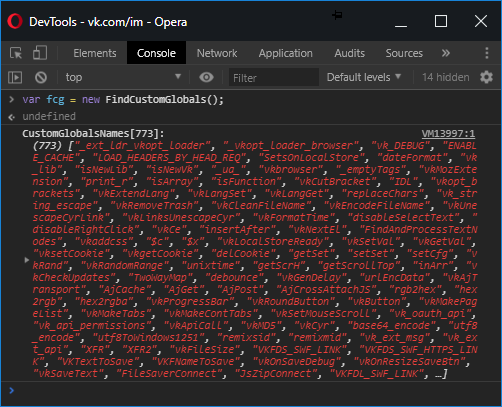

# Find Custom Globals

Этот скрипт будет полезен тем, кто пытается разбирается в работе чужих сайтов и/или писать для них собственные расширения. Выводит все кастомные глобальные переменные из window, отфильтровав родные браузерные свойства и методы. Позволяет удобно просматривать имена и значения этих переменных.


## Запуск
1. Скопировать содержимое скрипта [**findCustomGlobals.min.js**](https://github.com/neyasbltb88/find-custom-globals/blob/master/dist/findCustomGlobals.min.js) и вставить в консоль браузера на нужной странице. Будет работать до перезагрузки страницы.

2. Для постоянного использования необходимо воспользоваться расширениями браузера, которые позволяют подгружать собственные скрипты на чужие сайты. Для примера можно взять расширение [**Resource Override**](https://chrome.google.com/webstore/detail/resource-override/pkoacgokdfckfpndoffpifphamojphii?hl=ru), создать для нужного сайта новое правило, выбрать `Inject File` -> `Edit File` и в редактор вставить содержимое скрипта [**findCustomGlobals.min.js**](https://github.com/neyasbltb88/find-custom-globals/blob/master/dist/findCustomGlobals.min.js).

## Использование
> Когда скрипт загружен на страницу, его класс помещается в глобальную переменную `window.FindCustomGlobals`.

> Скорее всего этот скрипт будет использоваться прямо в консоли браузера, поэтому примеры будут так же в ней.

Для активации скрипта создаем экземпляр класса:
```js
var fcg = new FindCustomGlobals();
```
> Чтобы не засорять глобальную область еще одной переменной, здесь вместо var можно использовать let.

В случае успешного запуска мы должны увидеть в ответ массив имен кастомных глобальных переменных:



## Методы
Кроме автоматического вывода массива имен кастомных глобальных переменных есть несколько методов для более удобного поиска нужной среди них.

### .showCustomGlobalsNames()
Возвращает массив имен кастомных глобальных переменных. Такой же, как выводится после инициализации экземпляра класса.

### .showCustomGlobals()
Возвращает объект всех глобальных перменных, где ключами являются имена переменных, а значениями - значения соответствующих переменных:

")

### .showNextGlobal()
С каждым вызовом возвращает объект следующей глобальной переменной из массива, который возвращает метод `.showCustomGlobalsNames()` + индекс в этом массиве:
")

### .setNextGlobalCounter()
Чтобы начать просматривать переменные с определенного индекса, можно этот индекс сразу установить во внутренний счетчик:

")

### .resetNextGlobalCounter()
Сбрасывает внутренний счетчик на 0. Тоже самое можно сделать с помощью `.setNextGlobalCounter(0)`:

")

### .getGlobalName(index)
Возвращает одно имя глобальной переменной из массива всех имен по переданному индексу:

")

### .getGlobalValue(index)
Возвращает одно значение глобальной переменной из массива всех имен по переданному индексу:

")

### .getGlobal(index)
Возвращает объект одной глобальной переменной из массива имен по переданному индексу. Ответ содержит поля index, name и value:

")

### .run()
Запускает новый процесс сбора имен глобальных переменных. Можно использовать для обновления списка до актуального состояния. Сбрасывает внутренний счетчик индекса для метода `.showNextGlobal()`:

")